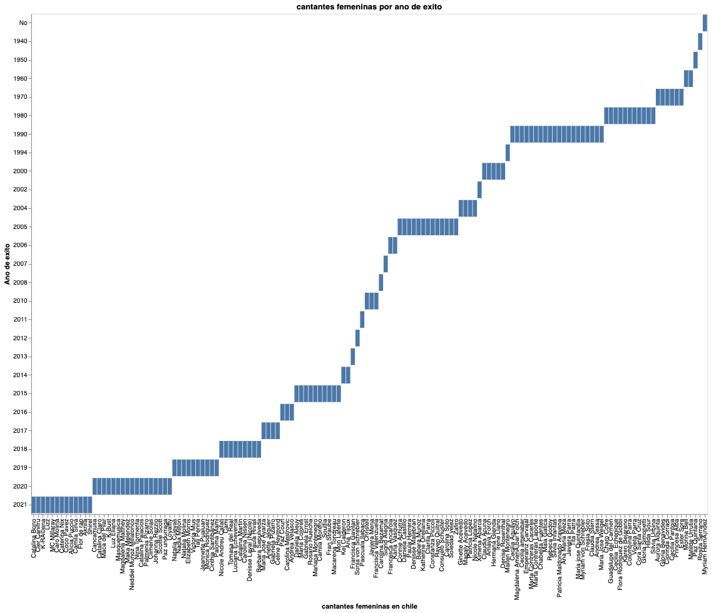
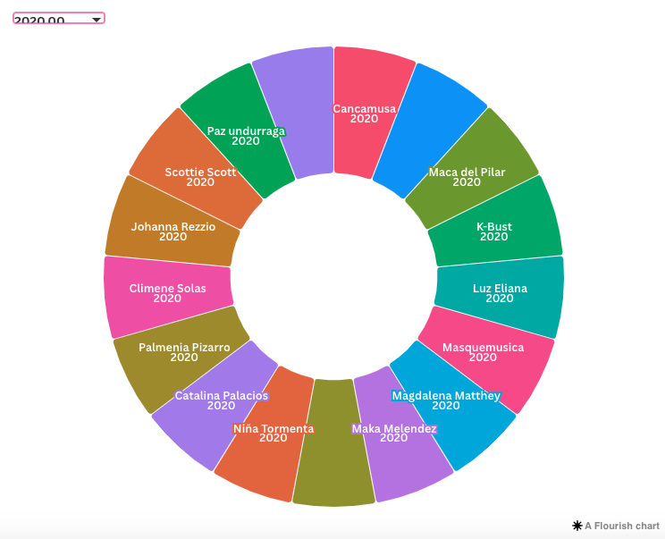
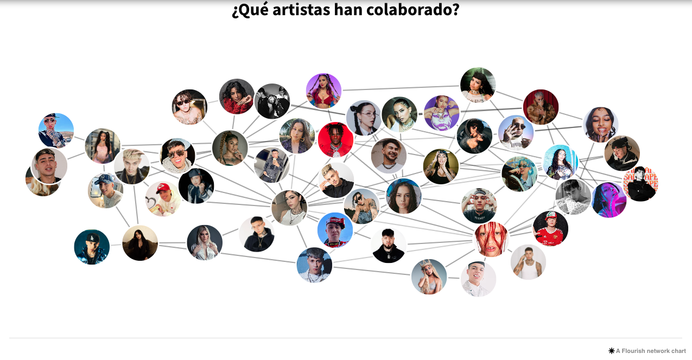
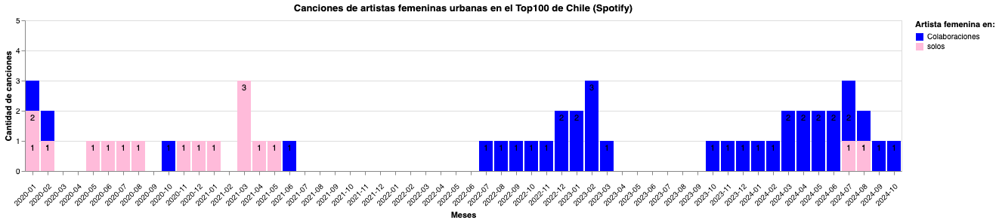
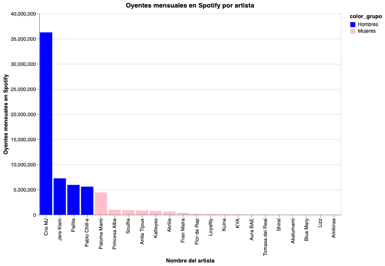
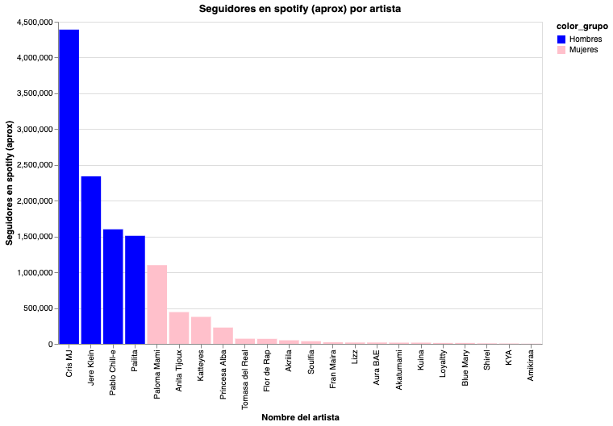

# Propuesta de visualizaciones atomicas

## Visualizaciones 1 y 2 (Antonia)

Estas visualización muestran de una de forma lineal y otra de forma interactiva, como durante los años han ido adquiriendo éxito las cantantes femeninas en general, sin filtrar entre géneros o estilos musicales.
En esta se toman en cuenta los nombres de 125 mujeres cantantes desde el año 1940, al año 2020, que fueron los datos arrojados por Wikipedia. Esta medición de éxito se hizo en base a que tan escuchadas y conocidas fueron las cantantes en su país, ya sea por ser escuchadas en la radio, o con plataformas digitales.
Estos gráficos muestra de forma visual como hay años en los que existe un alza en este éxito, los cuales son: 1990, 2005, 2015, 2019, 2020 y 2021. 
Con estos años claramente marcados en éxito, se da a conocer que hay un contexto histórico detrás que da el panorama propicio para que las artistas tengan éxito, los cuales son el término de la dictadura en los noventa, y las olas feministas de los años siguientes.

Variables de las visualizaciones: 
- **Nombre de las cantantes:** Reflejan que cantantes son las más escuchadas y conocidas en sus épocas, además de dar una referencia de qué género musical se trata.
- **Año de éxito de las cantantes:** Muestra en qué año las cantantes femeninas tuvieron más éxito, haciendo que uno se pregunte que influyó en este éxito, y dando paso al contexto histórico.

Tendencias visibles:
- Los años 1990, 2005, 2015, 2019, y 2020 muestran una clara mayoría de cantantes con éxito en comparación a otros,
- Existen 6 años que solo tuvieron a una cantante femenina con éxito
- Los años en que las artistas tuvieron más éxito estuvieron marcados por el feminismo y las libertades hacia la mujeres como las olas feministas o el fin de la dictadura.

Proceso de creación: 
- **Fuente de datos:** Se utilizó un archivo CSV con información sobre las cantantes femeninas que existen en chile, con año de exitos, fecha de nacimiento, presencia en spotify y presencia en youtube, lo cual luego se redujo a una base más pequeña sobre el nombre de las cantantes y su año de éxito
- **Procesamiento de datos:** Se filtraron los nombres de 125 cantantes urbanas. Y estas se clasificaron en año de éxito desde el 1940 al año 2021.
Se eliminaron las demás variables, para tener solo los datos sobre el año de éxito.

Diseño de la visualización 1 y 2:
- Se creó un gráfico de línea y los datos se agregaron por año para resaltar tendencias temporales y períodos con mucho éxito de las cantantes, o por el contrario, los que no tuvieron.

Herramientas utilizadas:
- **Altair:** Para diseñar el gráfico y flourish para el gráfico 2.

Proceso de Creación de la Visualización 2 - En Flourish
- Si bien esta visualización tiene la misma información que la visualización uno, esta está hecha de forma más interactiva para poder apretar un año y ver los nombres de las cantantes que tuvieron éxito.
- Los datos fueron organizados en un archivo excel, en donde la base de datos incluía nombre de las cantantes, año de éxito, presencia en spotify, presencia en youtube y año de nacimiento. Se guardó este archivo en CSV.
- **Flourish:** Utilicé Flourish Studio para crear un gráfico de “dona” el cual me permitió separar cada año con el nombre de las artistas que tuvieron éxito en ese año en específico, para así de forma interactiva poder escoger qué año visualizar para saber el número de éxito.
- **Personalización:** Se añadió el nombre de cada una de las artistas para identificarlas, y se las agrupó por año en un “single chart” que las muestra en diferentes colores
- **Publicación:** La visualización fue integrada en formato interactivo, y se compartió para así poder obtener el código html.

## Visualización 3 (Francisca)

Esta visualización corresponde a un mapa de conexiones o en este caso de colaboraciones entre artistas urbanos chilenos.

La historia de las mujeres en la música urbana chilena refleja una narrativa compleja de empoderamiento y desafío. Las colaboraciones con artistas masculinos destacan cómo la industria aún opera bajo dinámicas de género que pueden condicionar la visibilidad femenina. A través de esta visualización, el mensaje central es doble:

1. Reconocer el talento femenino y su capacidad para redefinir el género urbano.
2. Criticar las estructuras de poder que hacen que las colaboraciones sean una estrategia necesaria para alcanzar mayor audiencia y relevancia.

Esta dinámica no solo expone las limitaciones que enfrentan las mujeres, sino que también subraya la importancia de la unidad y la sinergia artística como herramienta de evolución dentro del género. 

La visualización busca capturar tres dimensiones clave:

1. **Conexiones Colaborativas:** Un mapa de redes que ilustra cómo las artistas femeninas se relacionan con otros artistas, destacando la prominencia de los hombres en las colaboraciones más exitosas.
2. **Impacto en Popularidad:** Reflejar cómo estas colaboraciones influyen en el éxito de las canciones.
3. **Tendencias de Género:** Subrayar la disparidad en visibilidad, destacando patrones que pueden ser analizados más a fondo para abordar la desigualdad.

El mensaje general es que, aunque las colaboraciones son beneficiosas, la industria aún está lejos de una igualdad genuina en términos de reconocimiento y visibilidad.

#### Proceso de Creación de la Visualización - Mediante Flourish

- **Recolección de Datos:** Se recopilaron datos sobre las colaboraciones de las artistas chilenas en plataformas de streaming (spotify). Los datos fueron organizados en un archivo exel, de modo que incluyera nodos (artistas) y enlaces (colaboraciones), permitiendo definir relaciones. Se guardo este archivo en CVS.
- **Carga en Flourish:** Se utilizó Flourish Studio para crear un network visualization, una herramienta que permite mapear y personalizar redes colaborativas. Y se cargo este archico CVS en la página.
- **Personalización:** Se añadio imagenes de cada uno de los artistas para identificarlos, se ajusto el tamaños de nodos y estilo visual para destacar a las mujeres y sus conexiones con artistas masculinos.
- **Publicación:** La visualización fue integrada en formato interactivo, permitiendo que los usuarios exploren cada colaboración y analicen los patrones por sí mismos.

## Visualización 4 (Valentina)

Esta visualización muestra cómo las colaboraciones musicales han sido un factor clave para el éxito de algunas cantantes chilenas. La visualización muestra la evolución de la presencia de artistas femeninas urbanas en el Top 100 de Spotify Chile entre enero de 2020 y octubre de 2024, destacando cómo esta participación ha sido impulsada mayoritariamente por colaboraciones con artistas masculinos. A lo largo del tiempo, se observa que, si bien las mujeres inicialmente dependieron de estas colaboraciones para ganar visibilidad en un género históricamente dominado por hombres, en los últimos años ha surgido un aumento gradual en canciones solistas, lo que refleja un proceso de consolidación y autonomía dentro de la música urbana chilena. Este análisis resalta el cambio en las dinámicas del género, con las mujeres desempeñando un papel cada vez más relevante al aportar perspectivas y estilos únicos.

**Ejes y colores:**
- Eje X (Meses): Representa la línea temporal desde enero 2020 hasta octubre 2024, mostrando la progresión de las cifras mes a mes.
- Eje Y (Cantidad de canciones): Indica el número de canciones de artistas femeninas urbanas presentes en el Top 100 de Spotify Chile.
**Colores:**
- Azul: Canciones donde las artistas femeninas participan en colaboraciones con hombres.
- Rosado: Canciones donde las artistas femeninas aparecen como solistas.

**Tendencias visibles:**

Las colaboraciones (barras azules) predominan claramente sobre las canciones en solitario (barras rosadas), lo que refuerza la idea de que las artistas femeninas urbanas han dependido, en gran parte, de colaboraciones con hombres para ingresar al ranking.
Hay meses donde las artistas femeninas desaparecen completamente del Top 100, lo que indica una presencia aún inestable en el mercado.
Sin embargo, en ciertos períodos (por ejemplo, 2023 y 2024), se observan picos tanto en colaboraciones como en canciones solistas, lo que podría sugerir un aumento reciente en la relevancia y autonomía de estas artistas.

**Mensajes a comunicar:** 

- **Inicio impulsado por colaboraciones masculinas:** La gráfica muestra cómo, en los primeros años del análisis (2020-2022), las colaboraciones masculinas son casi la única forma en que las mujeres logran entrar al ranking. Esto respalda la hipótesis de que el acceso inicial de las artistas femeninas al género urbano fue facilitado por su participación en proyectos con hombres.
- **Progresiva consolidación y autonomía:** A partir de 2023, se ve un leve aumento en la cantidad de canciones solistas. Aunque aún no igualan a las colaboraciones, esta tendencia es una señal del crecimiento de las artistas femeninas como figuras independientes dentro del género urbano chileno.
- **Dimensión de género y dinámicas de poder:** La visualización evidencia una transición en la dinámica de género dentro del género urbano. Inicialmente, las mujeres se apoyan en estructuras dominadas por hombres, pero con el tiempo comienzan a establecerse como agentes de cambio, aportando nuevas narrativas y estilos al género.

Proceso de creación: 
- **Fuente de datos:** Se utilizó un archivo CSV con información mensual de las 100 canciones más escuchadas en Spotify Chile (enero 2020 - octubre 2024).
- **Procesamiento de datos:** Se filtraron canciones de 17 artistas femeninas urbanas. 
- Las canciones se clasificaron como solistas o colaboraciones.
- Se eliminaron variables redundantes para mantener solo los datos necesarios sobre su evolución en el ranking.

Diseño de la visualización:
- Se creó un gráfico de barras apiladas.
- Se diferenció entre colaboraciones (color azul) y canciones solistas (color rosado).
- Los datos se agregaron por mes para resaltar tendencias temporales y períodos sin presencia femenina.

Herramientas utilizadas:
- **Excel:** Para limpieza inicial y agregación de datos.
- **Google Colab:** Para ejecutar el procesamiento con Python y coordinar el flujo de trabajo.
- **Altair:** Para diseñar el gráfico, configurando ejes, colores, títulos y leyendas.

## Visualizaciones 5, 6 y 7 (Francisca)

La narrativa se centra en cómo las artistas femeninas urbanas chilenas están logrando destacar en el mundo digital a pesar de la brecha persistente en visibilidad en comparación con sus colegas masculinos. Esta historia no solo subraya los logros individuales de artistas como Paloma Mami, Princesa Alba y Kateeyes, sino que también pone de manifiesto las desigualdades estructurales que enfrentan en plataformas clave como Spotify e Instagram.

Las visualizaciones tiene tres variables principales: 

- **Oyentes Mensuales:** que reflejan la cantidad de personas que reproducen sus canciones de manera regular.

- **Seguidores en Spotify:** que evidencian un compromiso más profundo, ya que estos usuarios suelen recibir notificaciones de lanzamientos y seguir de cerca las novedades de las artistas.

- **Seguidores en Instagram:** que muestran una popularidad que trasciende lo musical, destacando el interés por el estilo de vida y la "marca personal" de las artistas.

La historia evidencia cómo las artistas han innovado en su manera de conectar con audiencias globales, desafiando los límites del género y construyendo nuevas narrativas para la música urbana chilena.

#### Mensajes a Comunicar con las Visualizaciones:
- **Comparación de Género:** Resaltar la disparidad en números entre artistas femeninas y masculinos, subrayando tanto logros como retos.
- **Impacto Digital:** Ilustrar cómo las plataformas digitales ofrecen herramientas tanto para superar barreras como para perpetuar desigualdades.
- **Diversidad de Estrategias:** Mostrar cómo cada artista encuentra su propio camino hacia el éxito, ya sea a través de redes sociales, colaboraciones, o estilos únicos.

Se busca provocar reflexión sobre la importancia de igualdad de oportunidades en la industria musical.

#### Proceso de Creación de las Visualizaciones (Vega/Altair)

- Datos: Se trabajó con una base de datos que contiene las métricas de oyentes mensuales y seguidores en Spotify e Instagram de 17 artistas femeninas y cuatro masculinos.
- Se crearon visualizaciones tipo gráfico de barras, destacando a artistas mediante colores asociados al género (azul para hombres y rosado para mujeres).
- Se incluyó un orden descendente por métricas clave para facilitar la comparación visual.
- Se personalizaron: Títulos, ejes y leyendas se ajustaron para garantizar claridad.

**LOS SCRIPT Y BASE DE DATOS DE LAS VISUALIZACIONES REALIZADAS CON ALTAIR SE ENCUENTRAN EN LAS CARPETAS DE CADA VISUALIZACIÓN**
