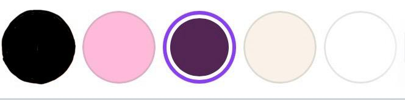
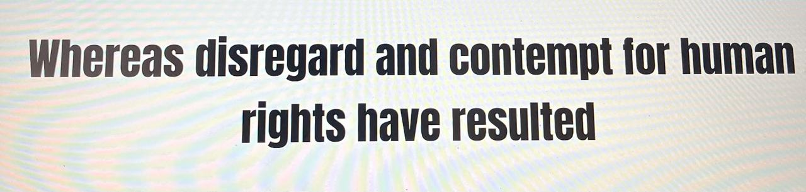

# Decisiones sobre los elementos visuales

## 1. Colores
### Elección de paleta de colores: 

- Los colores que escogimos para nuestra web story son: Rosado, Morado, Negro, Blanco Y Crema.

- El color rosado siendo uno de los principales, fue escogido porque expresa empoderamiento, además de femeneidad, que consideramos es lo que representan las cantantes urbanas chilenas tanto en sus videos, como en sus canciones.

- El morado lo escogimos, porque representa creatividad, y autenticidad. Y esto va ligado a lo que queremos que las personas sientan al entrar a la webstory.

También, otros colores que se utilizarán como el negro y el blanco añaden profundidad a las tipografías, además de contrastar y destacar las palabras.
### Función de colores:
- En los gráficos utilizaremos colores como el morado y el rosado. Además de algunos hechos en altair.
- Para resaltar información importante, como titulares o puntos clave utilizaremos colores en contraste, por ejemplo, si el fondo es rosado, las letras serán de color negro, o si el fondo es morado, las letras de blanco y vicerversa.
- Se va a crear jerarquía visual para guiar al usuario, utilizando en su mayoría los contraste del fondo rosado con tipografía negra, que son los colores predominantes de nuestro logo.

## 2. Logo

### Identidad del proyecto y Ubicación: 

- El logo será lo primero que aparecerá en nuestra webstory, siendo parte del encabezado.
- Este logo representa la música, y como el género femenino está construyendo su propio camino e identidad.
Se utiliza el micrófono que representa música, canción y sonido, y la palabra "femenino" que evoca a que no se trata de cualquier música, sino la hecha por mujeres.
La idea con este logo era ocupar pocos elementos, de forma que fuera simple y fácil de comprender, y que no estuviera saturado de elementos.
Incluímos el rosado para resaltar con el negro, de forma que representara lo "femenino", y el negro para que diera profundidad y sobriedad al fondo.
Ambos colores son parte de nuestra paleta de colores, y los incluímos en el logo para que siguieran la línea de la paleta.
## 3. Tipografías: 
- #### Selección de fuentes 

 Nuestra tipografía principal de google fonts es la fuente "Anton", la cual utilizaremos para títulos y subtítulos, ya que su diseño es en negrita, y un poco más grueso que una fuente pára párrafo, lo que ayuda a que resalte por sobre las demás.

 Nuestra tipografía secundaria es la fuente "Work sana" y será usada para el cuerpo y descripciones de la webstory. Esta es una letra menos gruesa que la principa, y no está en negrita, por lo que da a entender, que lo que está en grande es un título, y lo escrito por esta fuente es la información de ese título.

- ####  Consistencia y estilo: 
Elegimos este estilo en específico de fuentes porque tienen terminaciones más cuadradas, y alargadas, que dan más sobriedad a lo escrito, y así no se ven sobrecargadas junto con los colores y diseño de la web. Así es más facil para el usuario prestar atención a ellas, sin tanto ruido visual.
Además tomamos como referencia las tipografías de medio de música urbana, los cuales utilizan este tipo de estilo de fuentes.
## 4. Elementos gráficos complementarios
#### ÍCONOS :
Algunos íconos que utilizaremos son el menú, como también las imágenes de las artistas en sus videoclips o eventos.
 #### ILUSTRACIONES O FONDO

 #### FONDO:
 - El fondo será de color rosado y las letras de color negro
 #### FONDO TARJETAS DE INFORMACIÓN:
 - Fondo blanco y letras moradas. Ícono de "+" color morado con blanco.
#### ÍCONO DE MENÚ : 
- Color negro, y fondo del menú morado con letras rosadas.

#### BARRA DE DERECHOS RESERVADOS: 
- Fondo de color morado y letras rosadas
#### TARJETAS DE LAS CANTANTES:
#### (COLOR: FONDO BLANCO Y LETRAS MORADAS)

Estas serán tarjetas interactivas sobre las  10 canatantes urbanas más escuchadas del momento, que contarán con información sobre cada cantante además de una flecha que permite cambiar de tarjeta, y un ícno "+" para conocer la información.

#### VIDEOS: 
Se insertarán videos en cada sección de la webstory ya sea para contextualizar o para que el usuario vea de forma más visual lo que está leyendo.

#### MENÚ (COLOR DE FONDO MORADO Y LETRAS ROSADAS)
Posee cada sección de la webstory para poder ir directo hacia ella y saltarse las demás.

#### PLAYLIST DE SPOTIFY (COLOR NEGRO Y LETRAS BLANCAS JUNTO AL LOGO)
Esta es una playlist de musica urbana femenina chilena, creada para que el usuario pueda escucharla desde su cuenta de Spotify.

## 5. Coherencia visual
Para mantener un diseño coherente en la webstory, utilizaremos el color rosado de fondo predominantemente, excepto por algunos fondos que tendrán un color morado o negro, ya sea para resaltar colores de los gráficos o de elementos visuales.

Usaremos los mismos colores de la paleta, con los contraste mencionados (rosado y negro; morado y blanco; blanco y negro).
El estilos de bordes y tamaños de gráficos será el predeterminado.

### MENÚ: 
tendrá el fondo negro y letras rosadas
### SECCIONES: 
Serán separadas por fotos y tendrán videos y gráficos
### TARJETAS DE INFORMACIÓN: 
Letra morada y fondo blanco.
### GRÁFICOS:
Color azul para cantantes masculinos y rosado para las cantantes femeninas

